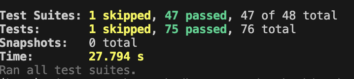
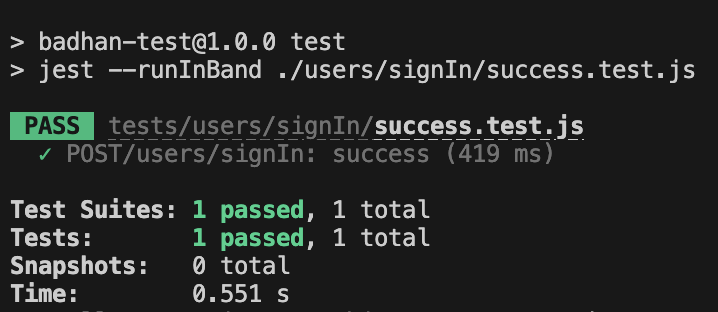

# badhan-test
`badhan-test` contains the automated API testing script written using Node.JS. The API being tested is currently the active backend for Badhan, BUET Zone Android app (https://play.google.com/store/apps/details?id=com.mmmbadhan) and Website (https://badhan-buet.web.app)

## Local setup
* Follow the instructions of [badhan-backend README.md](../badhan-backend/README.md) without deploying the backend. Keep the backend server running.
* Open a new bash/zsh terminal with `badhan-test` folder as the working directory.
* `npm install` or `npm i`

## To run all tests
* `bash start`

The following output should be shown:

## To run only a single test file
* `bash start <path to the test file>`.

Example: `bash start ./users/signIn/success.test.js`
The following output should be shown.

