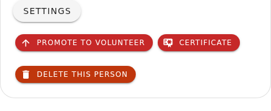
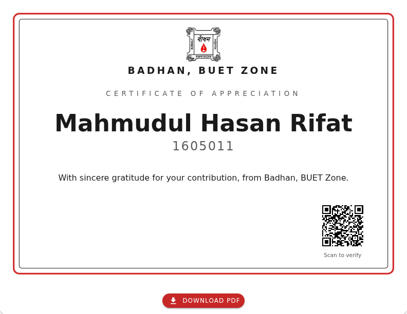
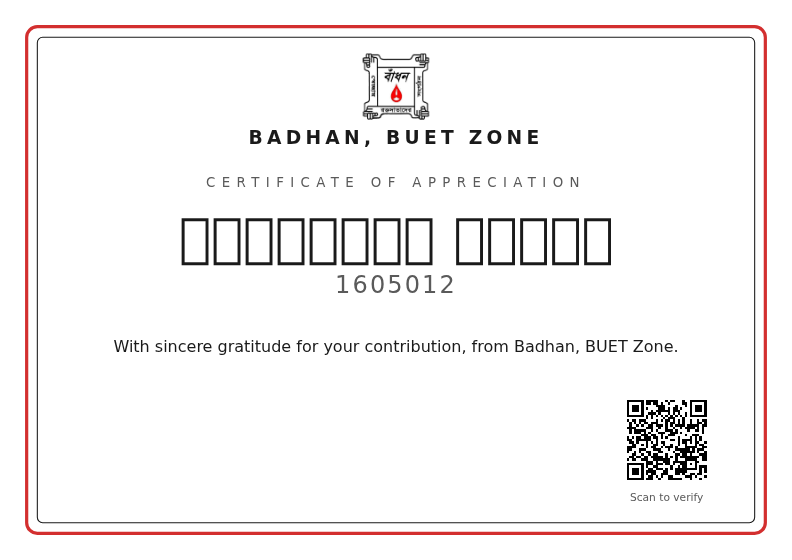

# নতুন ফিচার — ডোনার সার্টিফিকেট

এখন থেকে Badhan অ্যাপ থেকেই প্রতিটি ডোনারের জন্য একটি **সার্টিফিকেট** বের করা যাবে —
পর্দায় দেখা যাবে, PDF আকারে নামানো যাবে, ছাপিয়ে ডোনারের হাতে তুলে দেওয়া যাবে। আর সেই
কাগজের উপরে থাকা **QR কোড স্ক্যান করে যে কেউ যাচাই করতে পারবেন** যে কাগজটি সত্যিই বাঁধনের
দেওয়া।

এই লেখাটি সব ভলান্টিয়ার, হল অ্যাডমিন ও সুপার অ্যাডমিনের জন্য। এখানে কোনো কারিগরি কথা নেই —
কেবল অ্যাপে নতুন কী এল, আপনি কোথায় সেটা পাবেন, কীভাবে ব্যবহার করবেন, আর কোন ভুলগুলো
এড়িয়ে চলবেন।

---

## এক নজরে

১. ডোনারের প্রোফাইল পেজে **Settings** খুলুন।
২. নতুন **Certificate** বোতামে চাপ দিন — সার্টিফিকেট নতুন ট্যাবে খুলবে।
৩. **Download PDF** বোতামে চাপ দিয়ে PDF নামান।
৪. ছাপিয়ে ডোনারের হাতে দিন।
৫. পরে যে কেউ কাগজের QR কোড স্ক্যান করে যাচাই করতে পারবেন।

---

## ১. বোতামটি কোথায়

ডোনারের প্রোফাইল পেজে নিচের দিকে **Settings** কার্ডটি আছে। সেটি খুললে *Password Recovery
Link*-এর পাশেই নতুন **Certificate** বোতামটি দেখতে পাবেন।

বোতামে চাপ দিলে সার্টিফিকেটটি **নতুন ট্যাবে** খোলে — অর্থাৎ আপনি যে প্রোফাইলে কাজ করছিলেন
সেটি হারিয়ে যায় না।

অ্যাপে এর বাইরে আর কিছুই বদলায়নি। সাইডবারে নতুন কিছু নেই, পুরনো কোনো পেজ সরেনি।

---

## ২. সার্টিফিকেট দেখতে কেমন

সার্টিফিকেটে থাকে —

- বাঁধনের **লোগো** ও *BADHAN, BUET ZONE* লেখা
- **ডোনারের নাম**, বড় করে, মাঝখানে
- ডোনারের **স্টুডেন্ট আইডি**
- একটি **ধন্যবাদ বার্তা**
- ডান পাশে নিচে একটি **QR কোড**, তার নিচে ছোট করে লেখা *Scan to verify*

নিচের **Download PDF** বোতামটি সার্টিফিকেটের অংশ নয় — এটি পর্দাতেই থাকে, PDF-এ বা ছাপা
কাগজে যায় না।

### যা সার্টিফিকেটে **নেই**

নাম আর স্টুডেন্ট আইডি — এই দুটিই যায়, আর কিছু নয়। **ফোন নম্বর নেই, রক্তের গ্রুপ নেই,
হল বা রুম নম্বর নেই, ঠিকানা নেই, রক্তদানের তারিখ বা সংখ্যা নেই, মন্তব্য বা কল রেকর্ড নেই।**

এটি ইচ্ছাকৃত, এবং কারণটি পরের ধারায়।

---

## ৩. সার্টিফিকেট দেখতে লগইন লাগে না

সার্টিফিকেটের পাতাটি **সবার জন্য খোলা**। যিনি কাগজটি যাচাই করছেন — একজন চাকরিদাতা, একটি
বিশ্ববিদ্যালয়, বা যে কেউ — তাঁর বাঁধনের অ্যাকাউন্ট থাকার কোনো কারণ নেই। তাই পাতাটি
লগইন ছাড়াই খোলে।

এর মানে হলো, **লিংক যাঁর কাছে আছে তিনিই পাতাটি খুলতে পারবেন**। ঠিক এই কারণেই সার্টিফিকেটে
নাম ও স্টুডেন্ট আইডি ছাড়া আর কোনো তথ্য রাখা হয়নি — যাতে পাতাটি কখনো ডোনারের ব্যক্তিগত
তথ্য ফাঁসের পথ না হয়ে ওঠে।

---

## ৪. QR কোড কীভাবে কাজ করে

কাগজে ছাপা QR কোডটির ভেতরে **ওই সার্টিফিকেটেরই ঠিকানা** লেখা থাকে।

- কেউ কাগজটি হাতে নিয়ে ফোনের ক্যামেরা QR কোডের দিকে ধরেন।
- ফোনে বাঁধনের নিজস্ব ওয়েবসাইট খুলে যায় এবং সেখানে ঠিক একই সার্টিফিকেট ভেসে ওঠে।
- **কাগজের নাম ও স্টুডেন্ট আইডি পর্দার নাম ও স্টুডেন্ট আইডির সঙ্গে মিলে গেলে কাগজটি আসল।**

কেউ যদি ছবি এডিট করে নিজের নাম বসিয়ে নকল সার্টিফিকেট বানান, স্ক্যান করলেই ধরা পড়বে — হয়
ঠিকানাটি বাঁধনের ওয়েবসাইটে যাবেই না, নয়তো গেলেও পর্দায় অন্য কারো নাম উঠবে।

তাই সার্টিফিকেটের সবচেয়ে গুরুত্বপূর্ণ জিনিসটি হলো QR কোড। ছাপার সময় খেয়াল রাখবেন যেন
কোডটির উপরে কালি লেপ্টে না যায়, ভাঁজ না পড়ে, আর কাগজটি যেন খুব হালকা বা ধূসর না ছাপা হয়।

---

## ৫. PDF ডাউনলোড ও ছাপানো

**Download PDF** বোতামে চাপ দিলে —

- একটি **A4 আকারের, আড়াআড়ি (landscape)** PDF নেমে আসে, সরাসরি ছাপানোর উপযোগী।
- ফাইলের নাম হয় চেনার মতো, যেমন `Badhan-Certificate-1605011.pdf`।
- PDF-এ **শুধু সার্টিফিকেটটিই** থাকে — ডাউনলোড বোতাম বা ব্রাউজারের হেডার-ফুটার থাকে না।

ছাপানোর পর অনুরোধ থাকবে, **কাগজটি হাতে নিয়ে একবার নিজের ফোন দিয়ে QR কোডটি স্ক্যান করে
দেখে নিন** যে সেটি ঠিকঠাক খোলে। পর্দায় যে কোড দিব্যি কাজ করে, ছাপায় ছোট বা ঝাপসা হয়ে
সেটিই অচল হয়ে যেতে পারে।

---

## ৬. ছাপানোর আগে যে দুটি জিনিস অবশ্যই দেখে নেবেন

### ক) নাম ও স্টুডেন্ট আইডি ঠিক আছে তো?

সার্টিফিকেট প্রতিবার খোলার সময় ডাটাবেস থেকে নাম ও স্টুডেন্ট আইডি নতুন করে নিয়ে আসে। অর্থাৎ
অ্যাপে নামের বানান ঠিক করলে **পর্দায়** ঠিক নামটিই দেখা যাবে।

**কিন্তু ছাপানো কাগজ বদলায় না।** ছাপানোর পর যদি নাম সংশোধন করেন, তাহলে কাগজ আর পর্দা আর
মিলবে না — এবং যাচাই ব্যর্থ হবে। একবার ডোনারের হাতে চলে গেলে সেই কাগজ ঠিক করার আর কোনো
উপায় নেই, নতুন করে ছাপানো ছাড়া।

তাই **ছাপার আগে নাম ও স্টুডেন্ট আইডি ভালো করে দেখে নিন।**

### খ) নামটি ইংরেজিতে লেখা আছে তো?

সার্টিফিকেটটি পুরোপুরি **ইংরেজিতে** তৈরি। প্রোফাইলে যদি ডোনারের নাম **বাংলায়** লেখা থাকে,
তাহলে সার্টিফিকেটে নামের জায়গায় শুধু **ফাঁকা বাক্সের সারি** উঠবে — পর্দায়ও, ছাপা কাগজেও।

**অ্যাপ এ ব্যাপারে কোনো সতর্কবার্তা দেবে না।** তাই সার্টিফিকেট খোলার আগে প্রোফাইলে গিয়ে
নামটি ইংরেজিতে লিখে নিন, তারপর সার্টিফিকেট খুলুন।

---

## ৭. কারা সার্টিফিকেট বের করতে পারবেন

যিনি ডোনারের প্রোফাইল পেজ খুলতে পারেন, তিনিই **Certificate** বোতামটি দেখতে পাবেন — অর্থাৎ
ভলান্টিয়ার ও তার উপরের সবাই। আলাদা কোনো অনুমতির দরকার নেই।

সার্টিফিকেটে এমন কিছু নেই যা ওই ভলান্টিয়ার প্রোফাইলেই দেখতে পাচ্ছেন না, তাই এখানে বাড়তি
কড়াকড়ি রাখা হয়নি।

---

## ৮. আর্কাইভ করা ও মুছে ফেলা ডোনার

**আর্কাইভ করা ডোনারের সার্টিফিকেট আগের মতোই কাজ করে।** কেউ পাশ করে বেরিয়ে গেলেও তাঁর
সার্টিফিকেট স্ক্যান করলে ঠিকঠাক খুলবে — বরং পাশ করার পরই সার্টিফিকেটটির দরকার সবচেয়ে বেশি।

কিন্তু ডোনারকে ডাটাবেস থেকে **সম্পূর্ণ মুছে ফেললে** তাঁর নামে ছাপানো প্রতিটি সার্টিফিকেট
**স্থায়ীভাবে অচল হয়ে যায়**। স্ক্যান করলে এই বার্তাটি দেখাবে:

এটি ফিরিয়ে আনার কোনো উপায় নেই। **কাউকে ডিলিট করার সিদ্ধান্ত নেওয়ার আগে মনে রাখবেন, তাঁকে
যদি আগে সার্টিফিকেট দেওয়া হয়ে থাকে, সেটি তখনই নষ্ট হয়ে যাবে।**

যিনি শুধু পাশ করে বেরিয়ে গেছেন, তাঁর জন্য ডিলিট নয় — **আর্কাইভ**-ই সাধারণত সঠিক সিদ্ধান্ত।

একই বার্তাটি তখনও দেখা যায় যখন লিংকটি ভুল করে টাইপ করা হয়, বা QR কোডটি বাঁধনের নয়।

---

## ৯. প্রায়ই জিজ্ঞাসা করা প্রশ্ন

**সার্টিফিকেটের লিংকের কি মেয়াদ শেষ হয়?**
না। লিংক কখনো বদলায় না, মেয়াদও শেষ হয় না। আজ ছাপানো কাগজ দশ বছর পরেও স্ক্যান করলে কাজ করবে।

**একই ডোনারের সার্টিফিকেট কি একাধিকবার ছাপানো যায়?**
যায়। যতবার খুশি খুলুন, নামান, ছাপান — প্রতিবার একই সার্টিফিকেট পাবেন। কাগজে কোনো তারিখ বা
ক্রমিক নম্বর নেই, তাই দুটি কপির মধ্যে কোনো পার্থক্য থাকে না।

**ডোনার নিজে কি তাঁর সার্টিফিকেট নামাতে পারবেন?**
লিংকটি তাঁকে দিলে তিনি নিজেই পাতাটি খুলে PDF নামাতে পারবেন — লগইন লাগবে না।

**সার্টিফিকেটে রক্তদানের সংখ্যা যোগ করা যাবে না?**
আপাতত নয়। পাতাটি যেহেতু সবার জন্য খোলা, তাই ডোনার সম্পর্কে বাড়তি তথ্য সেখানে রাখা হয়নি।

**নামটি খুব লম্বা হলে কী হয়?**
লেখার আকার নিজে থেকে ছোট হয়ে যায়, দরকার হলে নামটি দুই লাইনে ভাগ হয়। নামের কোনো অংশ কাটা
পড়ে না, বর্ডারের বাইরেও যায় না।

**ফোন থেকে PDF নামানো যাবে?**
যাবে। অ্যান্ড্রয়েড ও আইফোন — দুটিতেই কাজ করে, তবে ফাইলটি কোথায় গিয়ে জমা হয় তা ফোনভেদে
আলাদা।

---

## ১০. সংক্ষেপে যা মনে রাখতে হবে

- সার্টিফিকেট খুলবেন: **ডোনার প্রোফাইল → Settings → Certificate**
- ছাপার আগে **নাম ও স্টুডেন্ট আইডি** মিলিয়ে নিন
- নামটি অবশ্যই **ইংরেজিতে** থাকতে হবে
- ছাপার পর **কাগজ থেকে একবার QR স্ক্যান করে** দেখে নিন
- **ডোনার ডিলিট করলে তাঁর ছাপানো সার্টিফিকেট চিরতরে অচল হয়ে যায়** — আর্কাইভ করাই নিরাপদ

আরও বিস্তারিত ম্যানুয়ালে আছে: [ডোনার প্রোফাইল অধ্যায়](../manual/07-the-donor-profile.md)।
