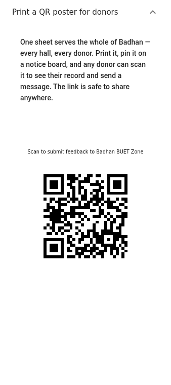
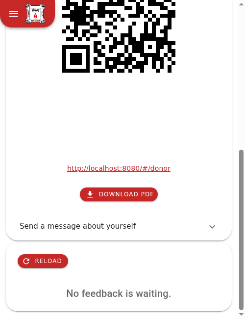
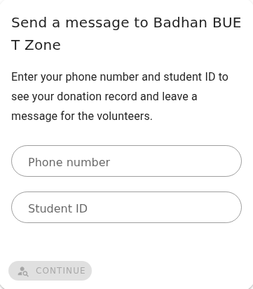
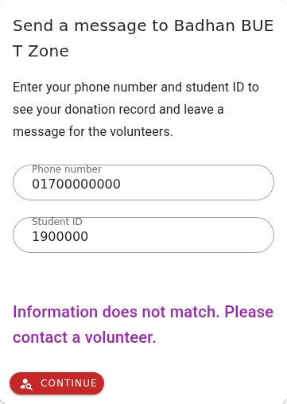
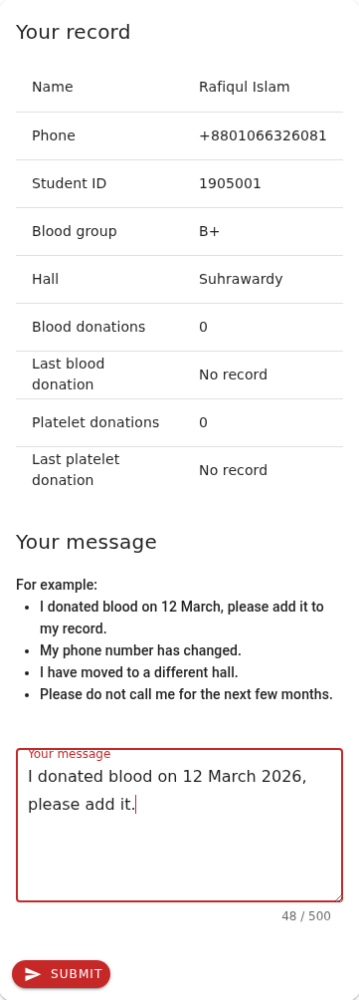
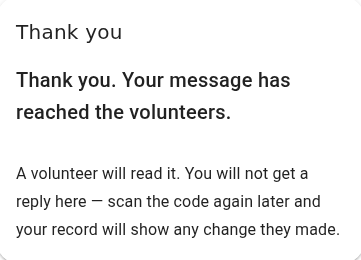
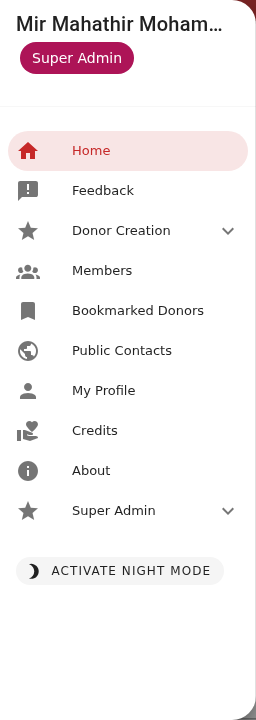
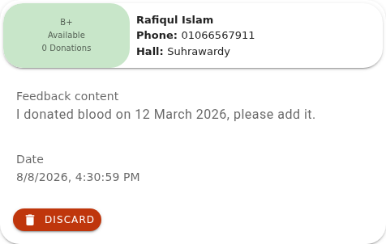
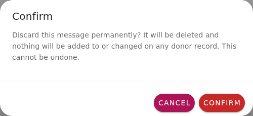
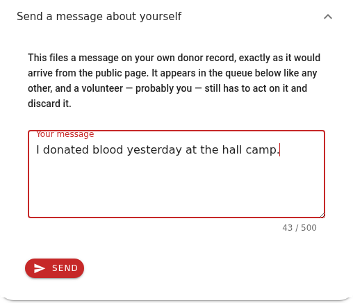

# নতুন ফিচার — ডোনার ফিডব্যাক

এখন থেকে একজন ডোনার **কোনো অ্যাকাউন্ট বা লগইন ছাড়াই** নিজের ফোন থেকে বাঁধনকে বার্তা পাঠাতে
পারবেন — "আমি ১২ মার্চ রক্ত দিয়েছি", "আমার নম্বর বদলেছে", "আমি হল বদলেছি"। বার্তাটি অ্যাপের
ভেতরে একটি নতুন **Feedback** পেজে আপনার কাছে এসে জমা হবে।

এই লেখাটি সব ভলান্টিয়ার, হল অ্যাডমিন ও সুপার অ্যাডমিনের জন্য। এখানে কোনো কারিগরি কথা নেই —
কেবল অ্যাপে নতুন কী এল, ডোনার কী দেখেন, আপনি কী দেখেন, এবং আপনাকে কী করতে হবে।

> এই লেখাটি **কেবল ফিডব্যাক** নিয়ে। নতুন ছাত্রদের নিজেদের তথ্য নিবন্ধন করার যে
> **রেজিস্ট্রেশন QR** ব্যবস্থাটি একই সঙ্গে এসেছে, সেটি আলাদা একটি লেখায় থাকবে।

---

## যে সমস্যাটির সমাধান হচ্ছে

ডাটাবেসে থাকা ডোনারদের বিরাট অংশের কোনো অ্যাকাউন্ট নেই — তাঁরা অ্যাপে ঢুকতেই পারেন না। কেউ
রক্ত দিয়ে এলে সেই খবরটা আমাদের কাছে পৌঁছানোর একমাত্র উপায় ছিল, তিনি কোনো ভলান্টিয়ারকে খুঁজে
বের করে মুখে বলবেন। মাঝখানে খবরটা হারিয়ে যেত, দেরি হতো, কিংবা কেউ বলার ঝামেলাই নিতেন না।

এখন একটি **পাবলিক পাতা** আছে, যেটি একটি QR কোড স্ক্যান করলেই খোলে। ডোনার নিজের ফোন থেকেই
বার্তাটি লিখে পাঠিয়ে দিতে পারেন।

**পুরো ব্যবস্থাটির একটিই মূল নিয়ম:** পাবলিক পাতা থেকে ডাটাবেসের একটি অক্ষরও বদলায় না।
সর্বোচ্চ যা হতে পারে তা হলো একটি বার্তা আপনার তালিকায় এসে জমা হওয়া। **পাবলিক দিকটি কেবল
"বলতে" পারে, "করতে" পারে না।**

---

## ১. পোস্টারটি কোথা থেকে বের করবেন

ডোনাররা পাতাটি পাবেন একটি ছাপানো QR পোস্টার থেকে, যেটি হলের নোটিশ বোর্ডে ঝোলানো থাকবে।

**সাইডবারে এর জন্য আলাদা কোনো এন্ট্রি নেই।** **Feedback** পেজটি খুললে একদম উপরে একটি লাইন
পাবেন — *"Print a QR poster for donors"*। সেটিতে চাপ দিলে পোস্টারটি খুলে যাবে।

নিচে নেমে **Download PDF** বোতামে চাপ দিলে A4 আকারের একটি PDF নেমে আসবে — ছাপিয়ে নোটিশ
বোর্ডে ঝুলিয়ে দিন, চোখের উচ্চতায়, যেন কেউ ফোন তুলে ধরতে পারেন।

দুটি কথা মনে রাখবেন —

- **পুরো বাঁধনের জন্য একটিই পোস্টার।** প্রতিটি হলের জন্য আলাদা কোড নেই, তাই একজন একবার
  নামিয়ে সব হলের জন্য কপি ছাপাতে পারেন।
- **লিংকটি গোপন কিছু নয়।** বোতামের উপরে ঠিকানাটি লেখা আছে; সেটি ফেসবুক গ্রুপে বা হলের
  হোয়াটসঅ্যাপে শেয়ার করাই বরং ভালো। গোপনীয়তা রক্ষা করছে ফোন নম্বর ও স্টুডেন্ট আইডি
  মেলানোর নিয়মটি, লিংকটি কে জানে সেটা নয়।

---

## ২. ডোনার যা দেখেন

### ২.১ প্রথম ধাপ — পরিচয় যাচাই

স্ক্যান করলে প্রথমেই একটি ছোট ফর্ম আসে, দুটি ঘর: **ফোন নম্বর** ও **স্টুডেন্ট আইডি**।

দুটো তথ্যই **একই ডোনারের রেকর্ডে মিলতে হবে**। শুধু ফোন নম্বর দিয়ে কাজ চালালে যে কেউ অন্যের
নম্বর বসিয়ে তাঁর তথ্য দেখে ফেলতে পারতেন — দুটো মেলানোর নিয়মে সেই ঝুঁকি অনেক কমে।

না মিললে একটিই বার্তা আসে:

**কোন ঘরটি ভুল ছিল তা কখনো বলা হয় না** — ইচ্ছাকৃতভাবে। নইলে কেউ একের পর এক নম্বর বসিয়ে
বের করে ফেলতে পারতেন ডাটাবেসে কার কার নম্বর আছে। একই কারণে অল্প সময়ে বারবার ভুল চেষ্টা
করলে অ্যাপ কিছুক্ষণের জন্য থামিয়েও দেয়।

### ২.২ দ্বিতীয় ধাপ — নিজের তথ্য ও বার্তা

মিলে গেলে ডোনার নিজের রেকর্ডের একটি ছোট সারসংক্ষেপ দেখতে পান, আর তার নিচেই বার্তা লেখার ঘর।

যা দেখানো হয়: নাম, ফোন নম্বর, স্টুডেন্ট আইডি, রক্তের গ্রুপ, হল, মোট রক্তদান ও প্লেটলেট দান,
এবং সর্বশেষ দুটি তারিখ।

**যা দেখানো হয় না:** ঠিকানা, রুম নম্বর, ইমেইল, কমেন্ট, কল রেকর্ড, ভলান্টিয়ার/অ্যাডমিন
পর্যায়, রক্তদানের পুরো তালিকা। নিজের রেকর্ড ঠিক আছে কি না বোঝার জন্য এটুকুই যথেষ্ট।

**সব তথ্য কেবল পড়ার জন্য — কোনো এডিট বোতাম নেই, সেভ নেই, কিছুই নেই।** যিনি লিখছেন "আমার
নম্বর বদলে দিন", তিনি কিছুই বদলাননি — তিনি আপনাকে কাজটি করতে বলেছেন।

বার্তার ঘরে সর্বোচ্চ ৫০০ অক্ষর লেখা যায়, আর পাশে কয়েকটি উদাহরণ দেখানো থাকে যেন কী লিখতে হবে
বুঝতে সুবিধা হয়।

> **তারিখের জন্য আলাদা ঘর নেই কেন?** ইচ্ছাকৃতভাবে। একটি খোলা লেখার বাক্স সব ধরনের খবরের জন্য
> কাজ করে — রক্তদানের তারিখ, নম্বর বদল, হল বদল, ভুল তথ্য, সব। ডোনারকে ভাবতে হয় না কোন ঘরে কী
> বসাবেন; মানুষ যেভাবে কথা বলে সেভাবেই লিখতে পারেন। বাকি কাজটা আপনি করবেন।

### ২.৩ তৃতীয় ধাপ — ধন্যবাদ

**Submit** চাপলে ডোনারের কাজ শেষ।

লক্ষ করুন, এখানে পরিষ্কার করে বলে দেওয়া আছে যে **কোনো উত্তর আসবে না** — কয়েকদিন পর আবার
স্ক্যান করে নিজের হালনাগাদ তথ্য দেখাই তাঁর নিশ্চয়তা।

**পাবলিক পাতা দুটি ইংরেজিতে।** ডেস্কে বসা ভলান্টিয়ার হিসেবে আপনি পাশে থেকে সাহায্য করতে
পারবেন।

---

## ৩. নতুন পেজ: Feedback

সাইডবারে একটি নতুন এন্ট্রি এসেছে — **Feedback**। ভলান্টিয়ার ও তার উপরের সবাই এটি দেখতে পান।

**পাশে কোনো সংখ্যা বা লাল বিন্দু নেই।** কোনো নোটিফিকেশন নেই, ইমেইল নেই, এসএমএস নেই।
**অ্যাপ আপনাকে জানাবেই না যে কাজ জমে আছে।** এটি ইচ্ছাকৃত — অ্যাপ কখনোই নোটিফিকেশন পাঠায় না —
কিন্তু এর মানে হলো, **পেজটি খোলা আপনার অভ্যাস না হলে ব্যবস্থাটি কাজ করবে না।**

**দিনে অন্তত একবার Feedback পেজটি খুলুন।** কেউ না দেখলে ডোনাররা বার্তা লিখবেন, কেউ পড়বে না,
আর কিছুদিন পর তাঁরা লেখা বন্ধ করে দেবেন।

প্রতিটি বার্তা একটি কার্ড হিসেবে আসে। কার্ডের **উপরের অংশটি হুবহু সেই ডোনার কার্ড যা আপনি
সার্চের ফলাফলে দেখেন** — নতুন কোনো ডিজাইন শিখতে হবে না।

নিচে থাকে **Feedback content** (ডোনার যা লিখেছেন, হুবহু), **Date** (কখন পাঠিয়েছেন), আর
একটি **Discard** বোতাম।

তালিকাটি **সবচেয়ে পুরোনো আগে** — যাতে কারও বার্তা নিচে চাপা পড়ে মাসের পর মাস ঝুলে না থাকে।

> নতুন ছাত্রদের নিবন্ধন জমাগুলোও **একই তালিকায়** আসে, তবে সেগুলো দেখতে আলাদা এবং সেগুলোর
> কাজও আলাদা। সেটি এই লেখার বিষয় নয়।

---

## ৪. একটি বার্তা নিয়ে আপনি কী করবেন — তিনটি ধাপ

প্রতিটি কার্ডের জন্য, এই ক্রমে:

১. **পড়ুন।** ডোনার কী জানাতে চাইছেন বুঝে নিন।
২. **কাজটা করুন।** কার্ড থেকে ডোনারের প্রোফাইলে গিয়ে যা করার তা করুন — রক্তদানের তারিখ
   জানালে রক্তদান যোগ করুন, নম্বর বা হল বদলের কথা বললে তথ্য সম্পাদনা করুন।
৩. **Discard চাপুন।** বার্তাটি তালিকা থেকে সরে যাবে।

Discard চাপলে অ্যাপ আগে একবার নিশ্চিত করতে বলে:

---

## ৫. Discard নিজে থেকে কিছুই করে না

**Discard কেবল বার্তাটি মুছে ফেলে। ব্যস, এটুকুই।** এটি রক্তদান যোগ করে না, ফোন নম্বর বদলায়
না, কাউকে আর্কাইভ করে না, ডোনারকে কিছু জানায়ও না।

কথাটি আরেকবার পড়ুন, কারণ এটিই সবচেয়ে বেশি ভুল বোঝা হয়: **বার্তা Discard করা আর বার্তা
অনুযায়ী কাজ করা এক জিনিস নয়।** দ্বিতীয় ধাপটি না করে Discard চাপলে ডোনারের অনুরোধটি স্রেফ
হারিয়ে গেল।

**Discard স্থায়ী — ফেরানো যায় না।** কোনো আনডু বোতাম নেই, এবং অ্যাপের কোনো পাতায় মুছে ফেলা
বার্তা আর দেখা যায় না। লগে লেখাটি জমা থাকে, তাই একেবারে হারায় না — কিন্তু সেটি ফিরিয়ে আনতে
হলে যিনি অ্যাপটি রক্ষণাবেক্ষণ করেন তাঁকে ডাটাবেস ঘেঁটে বের করতে হবে। ধরে নিন Discard চূড়ান্ত।

**দুজন একসঙ্গে একই বার্তা Discard করলে?** কোনো সমস্যা নেই। প্রথমজনের কাজ হয়ে যায়, দ্বিতীয়জন
জানতে পারেন যে বার্তাটি ইতিমধ্যে নিষ্পত্তি হয়ে গেছে, আর কার্ডটি দুজনের পর্দা থেকেই চলে যায়।

---

## ৬. আপনি কোন বার্তাগুলো দেখবেন

নিয়মটি আপনি আগে থেকেই জানেন — **যে ডোনারকে আপনি আজ সার্চে পান, তাঁর বার্তাই আপনি দেখবেন।**
নতুন কোনো অনুমতির ধারণা এখানে নেই।

| আপনি | যে বার্তাগুলো দেখবেন |
| --- | --- |
| ভলান্টিয়ার | নিজের হলের ডোনার, হল নেই এমন ডোনার, এবং "সব হলের জন্য উন্মুক্ত" ডোনাররা |
| হল অ্যাডমিন | একই |
| সুপার অ্যাডমিন | সব |

অন্য হলের ডোনারের বার্তা আপনার তালিকায় **আসবেই না** — ধূসর হয়ে নয়, একেবারেই না।

---

## ৭. নিজের সম্পর্কে বার্তা পাঠানো

Feedback পেজের উপরে, পোস্টার প্যানেলের পাশেই আরেকটি লাইন আছে — **Send a message about
yourself**।

এটি খুলে লিখে **Send** চাপলে বার্তাটি **আপনার নিজের ডোনার রেকর্ডে** জমা হয়। ফোন নম্বর বা
স্টুডেন্ট আইডি টাইপ করতে হয় না — সেগুলো আপনার প্রোফাইল থেকেই নেওয়া হয়।

যা জমা হয় তা **একেবারে সাধারণ একটি বার্তা**। নিচের তালিকায় আর দশটার মতোই আসে, আপনার নিজের
ডোনার কার্ড দেখায়, এবং **কাউকে না কাউকে সেটির উপর কাজ করে Discard করতে হয় — সম্ভবত আপনাকেই**।
বার্তা পাঠালেই রক্তদান জমা হয় না, রেকর্ডও বদলায় না।

দুটি কাজে এটি সত্যিই উপকারী —

- **ব্যবস্থাটি কাজ করছে কি না যাচাই করা** — পোস্টার না ছাপিয়ে, কোনো ডোনারকে স্ক্যান করতে না
  বলেই। যেমন কোনো পরিবর্তনের পর, বা হলকে জানানোর আগে।
- **নিজের জন্য একটি নোট রেখে যাওয়া**, যেটি বাকি সবকিছুর সঙ্গে সারিতে দাঁড়াবে — চ্যাট থ্রেডে
  হারিয়ে যাওয়ার বদলে।

প্যানেলটি যদি বলে যে আপনার প্রোফাইল থেকে ফোন নম্বর বা স্টুডেন্ট আইডি পড়া যায়নি, তাহলে একবার
সাইন আউট করে আবার সাইন ইন করুন। এটুকুই যথেষ্ট।

---

## ৮. একটি সতর্কতা — বার্তা কোনো প্রমাণ নয়

কার্ডে যে ফোন নম্বর ও স্টুডেন্ট আইডি দেখছেন, সেগুলো **যিনি পাঠিয়েছেন তিনি যা টাইপ করেছেন**।
অ্যাপ যাচাই করে যে দুটো একটি আসল ডোনারের রেকর্ডে মেলে — কিন্তু যিনি টাইপ করছেন তিনিই যে ওই
ডোনার, সেটি যাচাই করার কোনো উপায় নেই। কারও ফোন নম্বর ও স্টুডেন্ট আইডি জানা থাকলে যে কেউ
তাঁর নামে বার্তা লিখতে পারেন।

তাই বার্তাকে **একটি দাবি হিসেবে দেখুন, নির্দেশ হিসেবে নয়**। বিষয়টি গুরুত্বপূর্ণ হলে —
রক্তদানের তারিখ, নম্বর বদল — রেকর্ড বদলানোর আগে ডোনারকে ফোন করে নিশ্চিত হয়ে নিন। দ্বিতীয়
ধাপটি এই কারণেই আছে।

---

## ৯. আপনার কাজে যা বদলাচ্ছে না

- সার্চ, সার্চের ফলাফল ও ফিল্টার — অপরিবর্তিত।
- নিজের হাতে রক্তদান যোগ বা বাদ দেওয়া — আগের মতোই।
- Bookmarked Donors, কল রেকর্ড, CSV আপলোড — অপরিবর্তিত।
- পরিসংখ্যান ও রিপোর্ট — অপরিবর্তিত। ফিডব্যাক কোনো হিসাবেই গোনা হয় না।
- ভলান্টিয়ার ও অ্যাডমিনদের অনুমতি — অপরিবর্তিত।

---

## ১০. সচরাচর জিজ্ঞাসা

**ডোনারের কি অ্যাকাউন্ট লাগবে?**
না। এটাই এই ফিচারের মূল কথা। কোনো লগইন নেই, পাসওয়ার্ড নেই, অ্যাপ ইনস্টল করাও লাগবে না —
শুধু ফোনের ক্যামেরা দিয়ে QR স্ক্যান।

**ডাটাবেসে যাঁর রেকর্ড নেই, তিনি স্ক্যান করলে কী হবে?**
তথ্য মিলবে না, তাই কিছু দেখতে পাবেন না; পাতায় লেখা থাকবে ভলান্টিয়ারের সঙ্গে যোগাযোগ করতে।
নতুন ডোনার হিসেবে নিবন্ধনের পথ সম্পূর্ণ আলাদা — এই পোস্টারের QR দিয়ে নিবন্ধন হয় না।

**একজন ডোনার কি এখান থেকে নিজের তথ্য বদলাতে পারবেন?**
না। তিনি কেবল দেখতে ও লিখে জানাতে পারবেন। বদলানোর কাজ আপনার।

**ফিডব্যাক এলে কি আমি নোটিফিকেশন পাব?**
না। কোনো সংখ্যা, ব্যাজ, ইমেইল বা এসএমএস নেই। দিনে একবার পেজটি খোলাই একমাত্র উপায়।

**ডোনার কি জানতে পারবেন তাঁর বার্তা নিয়ে কাজ হয়েছে কি না?**
সরাসরি কোনো উত্তর যায় না। তবে তিনি আবার স্ক্যান করলে নিজের হালনাগাদ তথ্য দেখতে পাবেন —
রক্তদানের সংখ্যা বা তারিখ বদলেছে কি না, সেটাই তাঁর নিশ্চয়তা।

**আর্কাইভ করা ডোনার কি বার্তা পাঠাতে পারবেন?**
হ্যাঁ, এবং সেই বার্তা আপনার তালিকায় আসবে। আর্কাইভ সার্চের বিষয়, রেকর্ড থাকার নয়।

**একই ফোন নম্বর একাধিক ডোনারের থাকলে?**
স্টুডেন্ট আইডি মিলিয়ে নেওয়া হয় বলে সঠিক রেকর্ডটিই বেরিয়ে আসে। দুটোই একাধিক ডোনারের ক্ষেত্রে
হুবহু এক হলে পাতা কিছু দেখাবে না — এটি ডাটাবেসে ডুপ্লিকেট রেকর্ডের লক্ষণ, যা এমনিতেই ঠিক
করা দরকার।

**কোনো ডোনার মুছে ফেললে তাঁর বার্তাগুলোর কী হবে?**
কার্ডটি তালিকায় থেকে যায়, তবে উপরে ডোনার কার্ডের বদলে লেখা থাকে যে এই ফোন নম্বর ও স্টুডেন্ট
আইডির সঙ্গে কোনো রেকর্ড মিলছে না। বার্তাটি পড়ে Discard করে দিন।

**তালিকা কি নিজে থেকে খালি হয়?**
না। কোনো বার্তা নিজে থেকে সরে না, যত পুরোনোই হোক। তালিকা লম্বা হওয়া মানে কিছু ভেঙে যায়নি —
মানে সারিটি নিয়ে কেউ কাজ করছে না।

**একজন ডোনার কি অসংখ্য বার্তা পাঠিয়ে তালিকা ভরিয়ে ফেলতে পারবেন?**
না। একই ডোনারের জন্য অল্প সময়ে বারবার পাঠানোর উপর সীমা আছে, আর প্রতিটি বার্তা সর্বোচ্চ
৫০০ অক্ষরের।

---

## ১১. সংক্ষেপে যা মনে রাখতে হবে

- পোস্টার নামাবেন: **Feedback পেজ → Print a QR poster for donors → Download PDF**
- **দিনে অন্তত একবার Feedback পেজটি খুলুন** — অ্যাপ আপনাকে কিছুই জানাবে না
- প্রতিটি কার্ডে তিনটি ধাপ: **পড়ুন → প্রোফাইলে গিয়ে কাজটা করুন → Discard করুন**
- **Discard নিজে থেকে কিছুই করে না**, আর সেটি ফেরানো যায় না
- বার্তা একটি **দাবি**, নির্দেশ নয় — গুরুত্বপূর্ণ হলে ফোন করে নিশ্চিত হয়ে নিন

আরও বিস্তারিত ম্যানুয়ালে আছে: [ডোনার ফিডব্যাক অধ্যায়](../manual/20-donor-feedback.md)।
