# নতুন ফিচার — নতুন ছাত্রদের নিজেদের তথ্য নিজেরাই দেওয়া

এতদিন যাঁর রেকর্ড ডাটাবেসে **নেই**, তাঁকে যোগ করার একটাই পথ ছিল — একজন ভলান্টিয়ার ল্যাপটপ
নিয়ে বসে একজন একজন করে টাইপ করবেন। এখন থেকে ভলান্টিয়ার একটি **রেজিস্ট্রেশন QR কোড** বানিয়ে
দেবেন, নতুন ছাত্ররা সেটি স্ক্যান করে নিজেদের তথ্য নিজেরাই লিখে পাঠাবেন, আর সেই জমাগুলো
**Feedback** পেজে এসে অপেক্ষা করবে।

**নবীনবরণের কথা ভেবেই এটি।** কোডটি প্রজেক্টরে একটি স্লাইডে বড় করে দেখান — পুরো ঘর একসঙ্গে
ফোন তুলে স্ক্যান করবে, আর যে যার তথ্য নিজেই বসিয়ে দেবে। একজন ভলান্টিয়ারের ল্যাপটপে একশো
জনের তথ্য টাইপ করার বদলে একশো জন নিজেরাই লিখে দিলেন — এটাই এই কোডটির আসল ব্যবহার।

এই লেখাটি সব ভলান্টিয়ার, হল অ্যাডমিন ও সুপার অ্যাডমিনের জন্য। এখানে কোনো কারিগরি কথা নেই।

> এই লেখাটি **কেবল নতুন ছাত্রদের তথ্য সংগ্রহ** নিয়ে। যাঁরা **আগে থেকেই ডাটাবেসে আছেন**
> তাঁদের বার্তা পাঠানোর ব্যবস্থাটি আলাদা — সেটি
> [ডোনার ফিডব্যাক](new-feature-feedback-submission.md) লেখায় আছে।

---

## সবচেয়ে জরুরি নিয়মটি আগে

**এই ফর্ম থেকে ডাটাবেসে কোনো ডোনার তৈরি হয় না।**

ছাত্র ফর্ম পাঠালে কেবল একটি **জমা** আপনার Feedback তালিকায় এসে বসে। ডোনার তৈরি হয় তখনই,
যখন একজন ভলান্টিয়ার সেটি পড়ে, যাচাই করে, **Save** চাপেন। পুরো ব্যবস্থাটি এই নিয়মের উপরেই
দাঁড়ানো — পাবলিক দিকটি কেবল "বলতে" পারে, "করতে" পারে না।

---

## ১. কোডটি কোথায় বানাবেন

সাইডবারে **Donor Creation** গ্রুপটি খুললে ভেতরে একটি এন্ট্রি আছে — **Donor Registration QR**।
ভলান্টিয়ার ও তার উপরের সবাই এটি দেখতে পান।

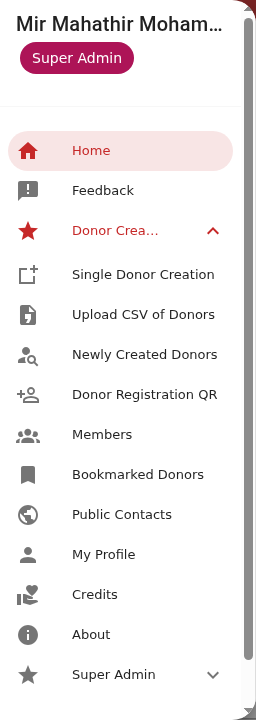

পাতাটি খুললে দুটি জিনিস দেখবেন — কোন হলের জন্য কোডটি হবে, আর কত সময়ের জন্য।

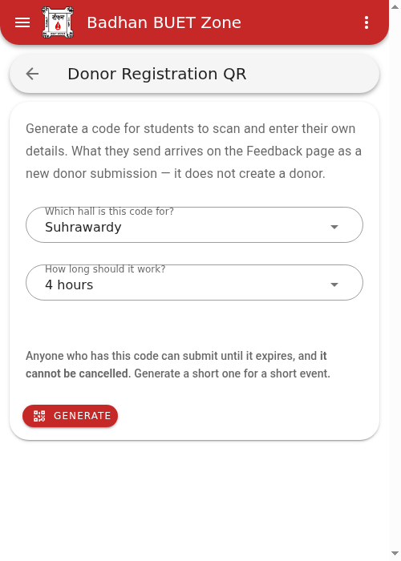

### হল কে বেছে নিতে পারেন

**ভলান্টিয়ার ও হল অ্যাডমিনের কোড সবসময় নিজের হলের জন্যই** — পাতায় কেবল লেখা থাকে কোন হল,
বদলানোর কোনো উপায় নেই।

**সুপার অ্যাডমিন যেকোনো হল বেছে নিতে পারেন**, উপরের ছবির মতো একটি ড্রপডাউন থেকে। তাই কোনো
হলের কোড দরকার হলে সেই হলে কারও রেকর্ড খুঁজে বের করার দরকার নেই — একজন সুপার অ্যাডমিনকে
বললেই হয়।

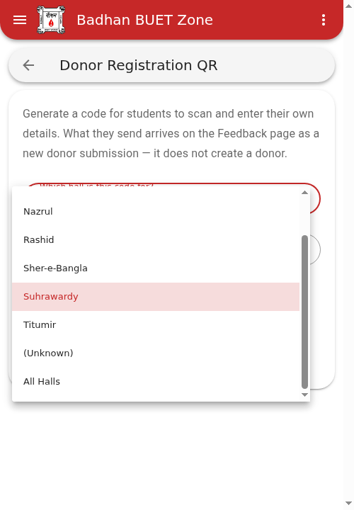

### All Halls — যে অপশনটি কোনো হল নয়

ড্রপডাউনের সবার শেষে একটি অপশন আছে যেটি কোনো হলের নাম নয় — **All Halls**। এটিও কেবল সুপার
অ্যাডমিনই বানাতে পারেন। এটি সেইসব অনুষ্ঠানের জন্য যেখানে **একাধিক হলের ছাত্র এক ঘরে**
থাকেন — যৌথ নবীনবরণ, কিংবা পুরো ক্যাম্পাসজুড়ে কোনো আয়োজন।

পার্থক্যটা ছাত্রের পর্দায় গিয়ে ধরা পড়ে:

| | সাধারণ কোড | All Halls কোড |
| --- | --- | --- |
| ছাত্র হলের ঘরটি | **দেখেন**, বদলাতে পারেন না | **নিজে বেছে নেন** |
| জমাটি যায় | কোডে বাঁধা হলের তালিকায় | **ছাত্র যে হল বেছেছেন** তার তালিকায় |

এর থেকে দুটি কথা বেরিয়ে আসে:

- **ছাত্র ভুল হল বাছলে জমাটি ভুল তালিকায় যাবে।** বড় কোনো ক্ষতি নয় — ডোনার তৈরির সময়
  হলটি তো আপনি নিজেই বসান, বানান ভুল থাকলে যেমন ঠিক করে নিতেন — তবু এটিই কারণ যে
  **একটি হলের অনুষ্ঠানে সেই হলের কোডটিই ব্যবহার করা ভালো।**
- **ডিফল্ট হিসেবে নিজের হলের কোডই বানান।** All Halls সেই ঘরগুলোর জন্য যেখানে একটি হলের কোড
  ভুল হতো; এটি একই জিনিসের উন্নত সংস্করণ নয়।

কোডটি বানানোর পর **কাগজে ও পর্দায় দুই জায়গাতেই লেখা থাকে কোন হলের জন্য এটি** — তাই ডেস্কে
পড়ে থাকা বা ডাউনলোড ফোল্ডারে জমা কোনো কোড স্ক্যান না করেই চেনা যায়।

### মেয়াদ

**How long should it work?** — ১, ২, ৪, ৮ বা ২৪ ঘণ্টা, **ডিফল্ট ৪ ঘণ্টা**।

মেয়াদটা যেন অনুষ্ঠানের সময়টুকু ঢেকে রাখে, এটুকুই হিসাব। নবীনবরণ দুপুর ২টা থেকে সন্ধ্যা ৬টা
হলে ৪ ঘণ্টার কোডই যথেষ্ট; সারাদিনের অনুষ্ঠান হলে ৮।

> **সতর্কতা — তৈরি করা কোড বাতিল করা যায় না।** মেয়াদ শেষ না হওয়া পর্যন্ত কোডটি যাঁর কাছেই
> পৌঁছাবে — ছবি তুলে, গ্রুপে পাঠিয়ে, যেভাবেই হোক — তিনিই ফর্ম পাঠাতে পারবেন। এই সতর্কবার্তাটি
> পাতাতেই লেখা আছে।
>
> সবচেয়ে খারাপ যা হতে পারে তা হলো আপনার হলের তালিকায় কিছু বাজে জমা পড়া, যা আপনি Discard
> করে দেবেন — কারও তথ্য ফাঁস হয় না, কোনো ডোনারও তৈরি হয় না। তবু **অনুষ্ঠান যত ছোট, মেয়াদ
> তত ছোট রাখুন।**

কে কখন কোন হলের জন্য কত সময়ের কোড বানিয়েছেন তা লগে জমা থাকে।

---

## ২. কোডটি তৈরি হওয়ার পর

**Generate** চাপলে কোডটি পর্দায় বড় করে আসে, আর তার ঠিক উপরে **পরিষ্কার ভাষায় লেখা থাকে কখন
এটি কাজ করা বন্ধ করবে**।

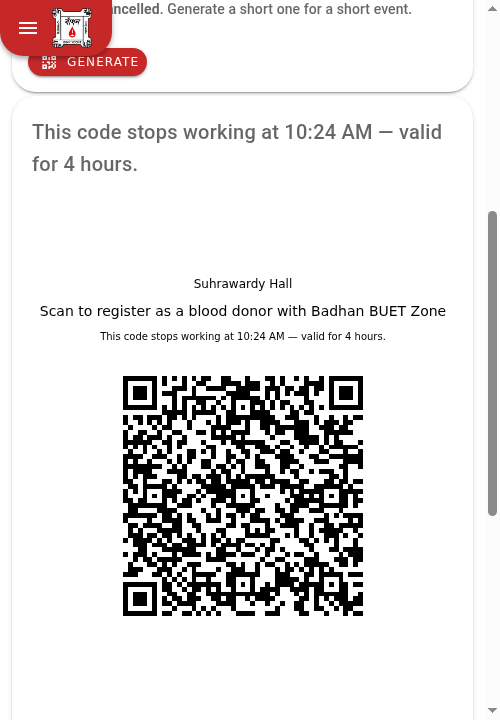

কোডের ঠিক উপরে **হলের নামটিও লেখা থাকে** — উপরের ছবিতে *Suhrawardy Hall*। All Halls কোডের
বেলায় সেখানে লেখা থাকে **All Halls**, আর তার আগে পাতায় এক লাইনে মনে করিয়ে দেওয়া হয় যে
ছাত্রদের এবার হলটি জিজ্ঞেস করা হবে:

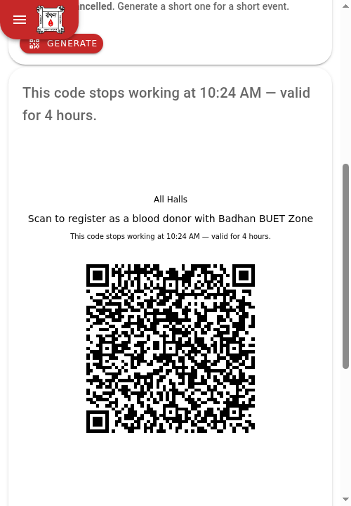

নিচে নামলে ঠিকানাটি, একটি সতর্কবার্তা আর দুটি বোতাম:

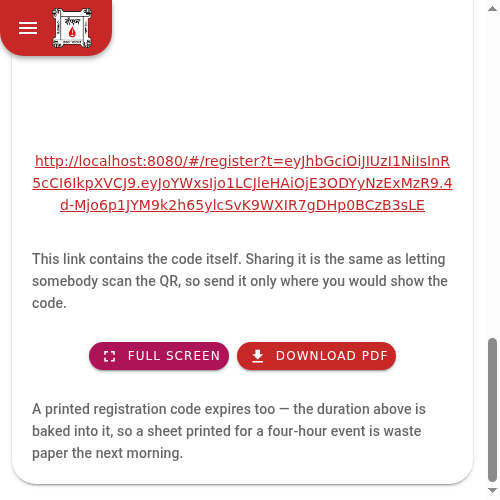

### লিংকটি নিয়ে সাবধান

নোটিশ বোর্ডের পোস্টারের ঠিকানাটি শেয়ার করা নিরাপদ — কিন্তু **এই লিংকটি আলাদা**। এর ভেতরেই
কোডটি বসানো, তাই **লিংকটি পাঠানো মানে কাউকে QR স্ক্যান করতে দেওয়া**। যেখানে কোডটি দেখাতেন,
কেবল সেখানেই পাঠান।

### কোডটি ব্যবহারের তিনটি উপায়

**ক) ডেস্কে পর্দা থেকে।** ল্যাপটপ বা ফোনটি টেবিলে রেখে দিন; ছাত্ররা একজন একজন করে পর্দা
থেকে স্ক্যান করবেন।

**খ) নবীনবরণে প্রজেক্টরে।** **Full Screen** বোতামে চাপলে অ্যাপের সব কিছু সরে গিয়ে সাদা
পর্দায় শুধু কোডটিই থাকে — প্রজেক্টরের জন্য এটিই ব্যবহার করবেন।

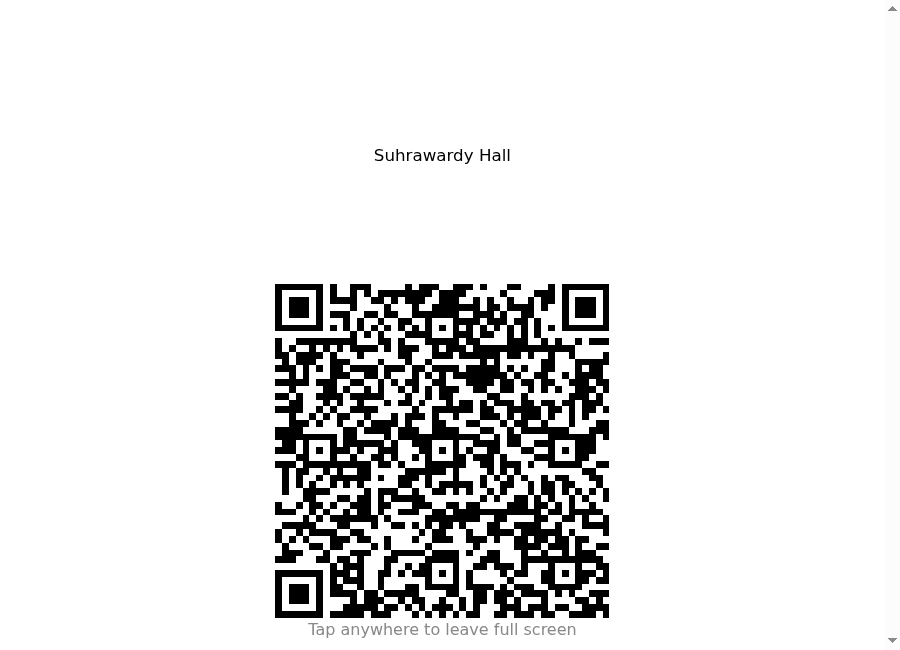

পর্দায় ট্যাপ করলে আবার আগের পাতায় ফিরে আসবেন। ঘরের আলো জ্বালানো থাকলে প্রজেক্টরের কোড
ঝাপসা লাগে, তাই **অনুষ্ঠানের আগে পেছনের সারিতে দাঁড়িয়ে একবার নিজে স্ক্যান করে দেখে নিন।**

**গ) ছাপানো কাগজ হিসেবে।** **Download PDF** চেপে ছাপিয়ে অনুষ্ঠানের ঘরে রেখে দিন। তবে
**এটি অনুষ্ঠানের কাগজ, নোটিশ বোর্ডের কাগজ নয়** — ছাপানো কোডেরও মেয়াদ শেষ হয়, তাই চার
ঘণ্টার অনুষ্ঠানের জন্য ছাপানো কাগজ পরদিন সকালে স্রেফ বাতিল কাগজ। **রেজিস্ট্রেশন কোড কখনো
নোটিশ বোর্ডে ঝুলিয়ে রাখবেন না।**

---

## ৩. ছাত্র যা দেখেন — একবারে একটি প্রশ্ন

স্ক্যান করলে বড় একটি ফর্ম আসে না। **একটির পর একটি প্রশ্ন আসে, পর্দায় একটি করে** — উত্তর
দিলে সেটি সরে গিয়ে পরেরটি আসে।

উপরে সবসময় লেখা থাকে **কত নম্বর প্রশ্ন, মোট কয়টির মধ্যে** — আর নিচে একটি পাতলা দাগ কতদূর
এগোলেন তা দেখায়। নিচে পুরো তালিকাটি একে একে দেওয়া হলো, ছাত্র যে ক্রমে দেখেন সেই ক্রমেই।

**কেন একটি করে প্রশ্ন?** কারণ প্রায় সবাই আসবেন ফোনের ক্যামেরা দিয়ে, প্রায়ই লাইনে দাঁড়িয়ে।
ফোনের পর্দায় একটি প্রশ্ন আর একটি বড় ঘর — এটুকু দাঁড়িয়ে দাঁড়িয়ে পূরণ করা যায়, আটটি ঘরের
একটি লম্বা ফর্ম যায় না। প্রতিটি উত্তর তার নিজের ধাপেই যাচাই হয়ে যায়, তাই ভুল থাকলে তখনই
ধরা পড়ে — সব লেখার পরে একগাদা ভুলের তালিকা হিসেবে নয়।

**BACK সবসময় আছে**, আর পেছনে গেলে আগের উত্তর মুছে যায় না। কেউ একটি সংখ্যা ভুল টাইপ করে
দুই পর্দা পরে খেয়াল করলে তাঁকে গোড়া থেকে শুরু করতে হয় না।

> **ডেস্কে দাঁড়ানো ভলান্টিয়ারের জন্য একটি কথা:** কেউ যদি বলেন "এটা তো একের পর এক প্রশ্ন
> করেই যাচ্ছে" — সেটাই স্বাভাবিক, আটকে যায়নি। প্রশ্নগুলো শেষ হলেই সব উত্তর একসঙ্গে দেখাবে।

### প্রশ্ন ১ — নাম

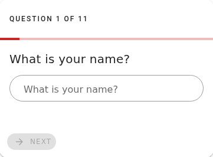

তিন অক্ষরের কম হলে **NEXT** ধূসরই থাকে। প্রতিটি প্রশ্নেই এভাবে — উত্তরটি ঠিক না হওয়া পর্যন্ত
এগোনোর বোতামটি কাজ করে না। এটাই "প্রতিটি উত্তর তার নিজের ধাপেই যাচাই হয়" কথাটির চেহারা।

### প্রশ্ন ২ — স্টুডেন্ট আইডি

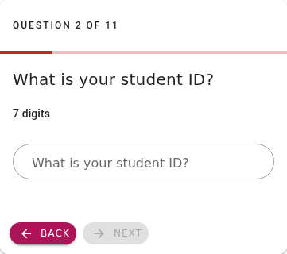

সাত সংখ্যা, আর অ্যাপে ডোনার তৈরির সময় যে নিয়মে আইডি যাচাই হয় ঠিক সেই নিয়মেই এখানে যাচাই
হয়। ভুল বিভাগ বা ভুল ব্যাচের আইডি এখানেই আটকে যাবে।

### প্রশ্ন ৩ — ফোন নম্বর

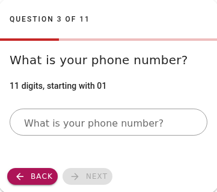

`01` দিয়ে শুরু ১১ সংখ্যা। **দেশের কোড লিখতে হয় না** — অ্যাপ নিজেই যোগ করে নেয়, ঠিক যেমন
অ্যাপের বাকি সব জায়গায় হয়।

### প্রশ্ন ৪ — রক্তের গ্রুপ

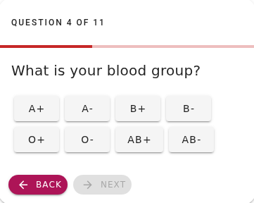

এখানে টাইপ করতে হয় না, ড্রপডাউনও নেই — আটটি বোতাম থেকে একটিতে চাপ দিলেই হলো। দাঁড়িয়ে
দাঁড়িয়ে ফোনে এটাই সবচেয়ে সহজ, আর ভুল বানানের কোনো সুযোগও থাকে না।

### প্রশ্ন ৫ — কোন হলে আছেন

এই প্রশ্নটি **দুই রকম দেখায়**, কোন ধরনের কোড স্ক্যান করা হয়েছে তার উপরে।

**সাধারণ কোডে হলটি দেখানো হয়, বদলানো যায় না** — ঘরটি ধূসর, আর নিচে এক লাইনে লেখা থাকে
জমাটি কোন হলের ভলান্টিয়ারদের কাছে যাবে:

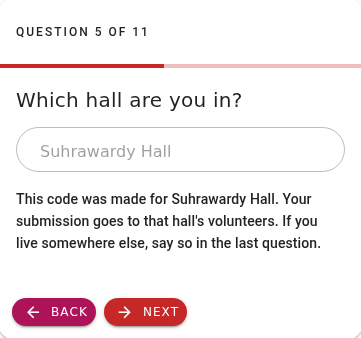

**All Halls কোডে এটি সত্যিকারের প্রশ্ন** — আটটি বোতাম, আগে থেকে কিছুই বাছা নেই, আর একটিতে
চাপ না দেওয়া পর্যন্ত **NEXT** ধূসরই থাকে:

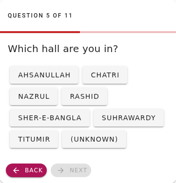

ছাত্র হিসেবে তিনি যা বেছে নেন, **সেই হলের তালিকাতেই** জমাটি যায়। কোনটি কোন ক্ষেত্রে,
সেটি [১ নম্বর অংশে](#all-halls--যে-অপশনটি-কোনো-হল-নয়) আছে।

### প্রশ্ন ৬ — আগে কতবার রক্ত দিয়েছেন

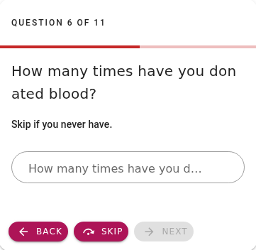

নিচে ছোট করে লেখা আছে *"Skip if you never have."* — কখনো না দিয়ে থাকলে **SKIP** চাপলেই হলো,
তখন সংখ্যাটি শূন্য ধরা হয়।

> **এখানে অগ্রগতির হিসাবটি লক্ষ করুন — "QUESTION 6 OF 11"।** কিন্তু পরের ছবিতেই সেটি
> "7 OF 12" হয়ে যাবে। কারণটি পরের প্রশ্নেই।

### প্রশ্ন ৭ — শেষ কবে রক্ত দিয়েছেন

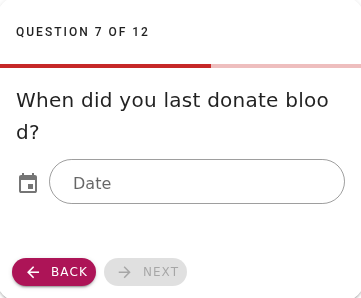

**এই প্রশ্নটি সবাই দেখেন না।** আগের প্রশ্নে শূন্য বললে বা SKIP চাপলে এই প্রশ্নটি একেবারেই
আসে না — কেউ কখনো রক্ত না দিয়ে থাকলে "শেষ কবে দিয়েছেন" প্রশ্নটির কোনো উত্তরই হয় না।

তাই মোট প্রশ্নের সংখ্যাটি **১১ থেকে শুরু হয়ে বাড়তে থাকে** — যিনি রক্ত দিয়েছেন বলেন,
তাঁর জন্য একটি প্রশ্ন যোগ হয়। সংখ্যাটি বাড়ে, কখনো কমে না।

তারিখটি টাইপ করতে হয় না — ঘরটিতে চাপ দিলে একটি ক্যালেন্ডার আসে:

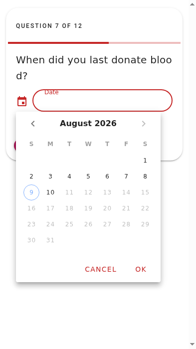

ভবিষ্যতের তারিখ বাছা যায় না।

### প্রশ্ন ৮ — আগে কতবার প্লেটলেট দিয়েছেন

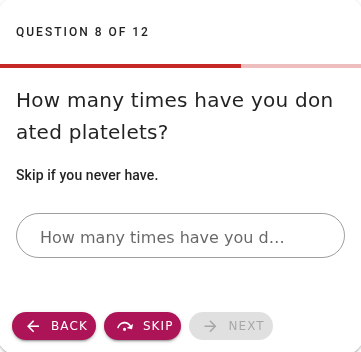

রক্তের প্রশ্নটির মতোই — SKIP মানে শূন্য।

### প্রশ্ন ৯ — শেষ কবে প্লেটলেট দিয়েছেন

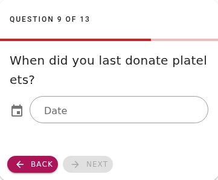

এটিও শর্তসাপেক্ষ: আগের প্রশ্নে শূন্য বললে এই প্রশ্নটি আসে না।

### প্রশ্ন ১০ — রুম নম্বর

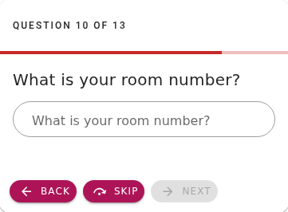

এখান থেকে বাকি প্রশ্নগুলোর উত্তর দেওয়া **বাধ্যতামূলক নয়** — প্রতিটির নিচে একটি **SKIP**
বোতাম আছে। খালি রেখে NEXT চাপার দরকার নেই; বাদ দেওয়ার জন্য আলাদা বোতামই আছে।

### প্রশ্ন ১১ — ঠিকানা

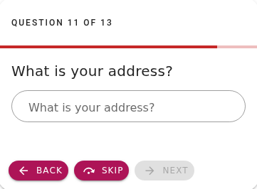

### প্রশ্ন ১২ — অন্য হলের ডোনাররা যোগাযোগ করতে পারবেন?

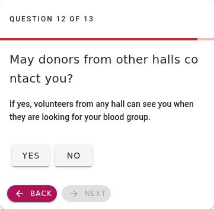

শুধু **YES/NO**, আর উপরে এক লাইনে ব্যাখ্যা করা আছে "হ্যাঁ" বললে কী হয় — অন্য যেকোনো হলের
ভলান্টিয়ার তাঁর রক্তের গ্রুপ খোঁজার সময় তাঁকে দেখতে পাবেন। **কিছু না বললে উত্তর "না"।**

### প্রশ্ন ১৩ — আর কিছু জানাতে চান?

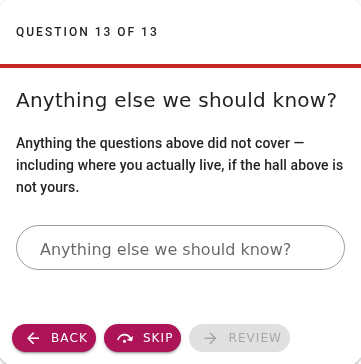

শেষ প্রশ্ন, এবং সবচেয়ে কাজের প্রশ্নগুলোর একটি। উপরের প্রশ্নগুলোতে যা ধরা পড়েনি তার সবই
এখানে লেখা যায় — **বিশেষ করে সাধারণ কোডে হলটি যদি তাঁর না হয়**, যেটি নিয়ে পরের ধারাটি।

### হলটি শেষ পর্যন্ত কে ঠিক করে

**সাধারণ কোডে হলটি ঠিক করে কোডই**, ছাত্র নন — তিনি কেবল দেখতে পান। তাই অন্য হলের কোড
স্ক্যান করা একজন ছাত্র **সেই হলের** তালিকায় গিয়ে পড়বেন। তিনি শেষ প্রশ্নের ঘরে নিজের আসল
হলের কথা লিখে রাখতে পারেন, আর ডোনার তৈরির সময় আপনি জিজ্ঞেস করে সঠিক হলটি বসিয়ে নেবেন।

**All Halls কোডে হলটি ঠিক করেন ছাত্র নিজেই** — তিনি যেটি বেছেছেন, জমাটি সেই হলের তালিকায়
যাবে। এখানে ভুলটি অন্য দিক থেকে আসতে পারে: তিনি ভুল হল বেছে ফেললে জমাটি ভুল তালিকায় যাবে।

দুই ক্ষেত্রেই শেষ কথাটা এক: **কার্ডের হলটিও ছাত্রের বাকি তথ্যের মতোই — দেখে নিতে হবে।**
ডোনার তৈরির ফর্মে হলটি আপনিই বসান, তাই ঠিক করে নেওয়া এক ক্লিকের কাজ।

### সব উত্তর একসঙ্গে দেখে নেওয়া

শেষে একটি **Check your answers** পর্দা আসে — সব উত্তর এক জায়গায়, প্রতিটির পাশে **EDIT**,
আর নিচে **SUBMIT**।

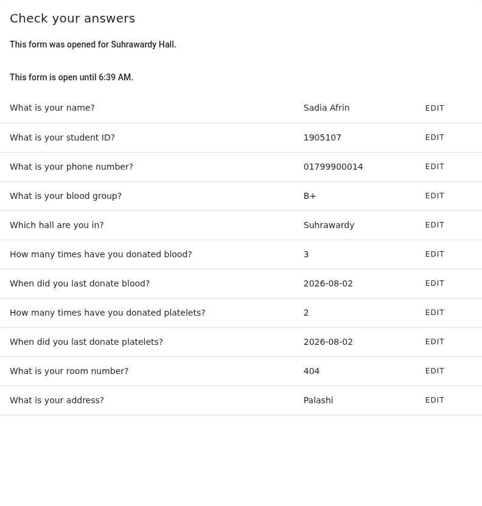

উপরে দুটি লাইন লক্ষ করুন — হলটি, আর কখন পর্যন্ত ফর্মটি কাজ করবে। সাধারণ কোডে লেখা থাকে
*"This form was opened for Suhrawardy Hall"*, আর All Halls কোডে *"You chose … Hall"* — অর্থাৎ
ছাত্র নিজে যা বেছেছেন।

তালিকার শেষে **BACK** ও **SUBMIT**:

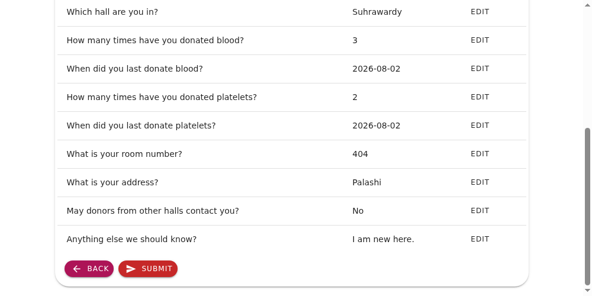

**SUBMIT না চাপা পর্যন্ত কিচ্ছু পাঠানো হয় না।** কেউ মাঝপথে ট্যাব বন্ধ করে দিলে আপনার কাছে
কিছুই আসবে না — অর্ধেক পূরণ করা কোনো কার্ড তালিকায় জমবে না। তাই কেউ যদি বলেন "আমি তো ফর্ম
পূরণ করেছি" অথচ কার্ড আসেনি, ধরে নিন তিনি মাঝপথে থেমে গেছেন — আবার স্ক্যান করতে বলুন।

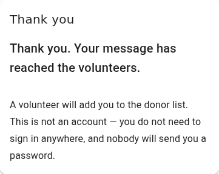

লক্ষ করুন, শেষ পর্দাতেই পরিষ্কার করে লেখা আছে যে **এটি কোনো অ্যাকাউন্ট নয়** — কোথাও সাইন
ইন করতে হবে না, কেউ পাসওয়ার্ডও পাঠাবে না। একজন ভলান্টিয়ার তাঁকে তালিকায় যোগ করবেন।

**পাতাটি ইংরেজিতে।** ডেস্কে বসা ভলান্টিয়ার হিসেবে আপনি পাশে থেকে সাহায্য করতে পারবেন।

---

## ৪. জমাটি আপনার কাছে যেভাবে আসে

জমাটি **Feedback** পেজে একটি কার্ড হিসেবে আসে — তবে সাধারণ বার্তার কার্ডের মতো নয়। উপরে
চেনা ডোনার কার্ডটি থাকে না, থাকার কথাও নয়, কারণ এই ব্যক্তি এখনো ডাটাবেসেই নেই।

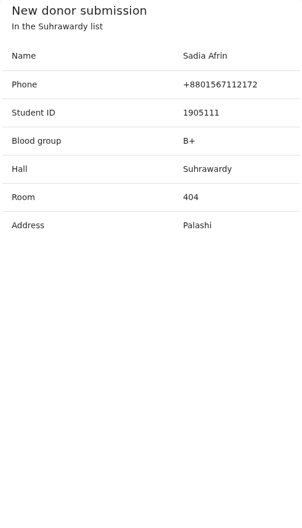

উপরে বড় করে লেখা থাকে **New donor submission**, আর তার নিচে জমাটি কোন হলের তালিকায় আছে।
টেবিলের ভেতরে **Hall** সারিটিতে থাকে ছাত্রের হল — সাধারণ কোডে সেটি কোডের হল, আর All Halls
কোডে ছাত্রের নিজের বাছাই।

নিচে নামলে রক্তদানের হিসাব ও দুটি বোতাম:

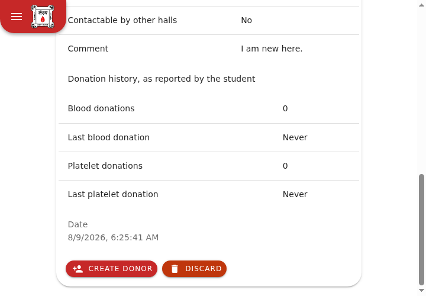

> **“Donation history, as reported by the student” — লাইনটি খেয়াল করুন।** এই সংখ্যাগুলো
> ছাত্রের নিজের দাবি, বাঁধনের কোনো রেকর্ড নয়। কেউ যাচাই করেনি। ডেস্কে মুখে বললে যেভাবে
> যাচাই করতেন, ঠিক সেভাবেই দেখে নিন।

---

## ৫. জমাটি নিয়ে আপনি যা করবেন

১. **পড়ুন।** ছাত্র যা যা লিখেছেন সবই কার্ডে সাজানো আছে।
২. **Create donor চাপুন।** অ্যাপের চেনা নতুন-ডোনার তৈরির ফর্মটিই খোলে, **আগে থেকে ভরা
   অবস্থায়**। নতুন কোনো পাতা শিখতে হবে না।

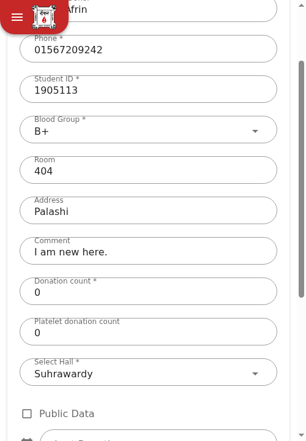

৩. **প্রতিটি ঘর দেখে নিন।** তথ্যগুলো ছাত্রের নিজের লেখা, কেউ যাচাই করেনি। হলটি ঠিক আছে
   কি না বিশেষভাবে দেখুন — সাধারণ কোডে সেটি এসেছে কোড থেকে, ছাত্রের কাছ থেকে নয়; আর
   All Halls কোডে ছাত্র নিজে বেছেছেন, কেউ যাচাই করেনি।
৪. **Create চাপুন।** ডোনার তৈরি হবে। ফোন নম্বর দিয়ে ডুপ্লিকেট পরীক্ষা এখানেও আগের মতোই
   চলবে, তাই একই ছাত্র দুই অনুষ্ঠানে দুবার নিবন্ধন করলে সেটি এখানেই ধরা পড়বে।
৫. **Feedback পেজে ফিরে গিয়ে জমাটি Discard করুন।**

> **শেষ ধাপটি ভুলবেন না।** ডোনার তৈরি হয়ে গেলেই জমাটি তালিকা থেকে সরে যায় না — সরানোর কাজটি
> আপনাকেই করতে হবে। ইচ্ছাকৃতভাবেই এমন: কেউ ভুল করে অন্য কাউকে তৈরি করে ফেললে মূল জমাটি যেন
> তাঁর সামনেই থেকে যায়। Discard-ও চূড়ান্ত, ফেরানো যায় না।

---

## ৬. দুটি জিনিস দেখতে ভুল লাগবে, কিন্তু ভুল নয়

**এক তালিকায় দুই রকম কার্ড।** সাধারণ বার্তা আর নতুন ডোনার জমা — দুটোই একই তালিকায় আসে,
পুরোনো আগে। আলাদা করার বা ছেঁকে নেওয়ার কোনো উপায় নেই। কোনো অনুষ্ঠানের পর কিছুদিন তালিকা
জুড়ে থাকবে নতুন ডোনারের কার্ড — বার্তাগুলো তালিকার নিচে, হারিয়ে যায়নি।

**তালিকা নিজে থেকে খালি হয় না।** কোনো জমা নিজে থেকে সরে না, যত পুরোনোই হোক। তালিকা লম্বা
হওয়া মানে কিছু ভেঙে যায়নি — মানে সারিটি নিয়ে কেউ কাজ করছে না।

---

## ৭. সচরাচর জিজ্ঞাসা

**এই ফর্ম থেকে কি সরাসরি ডোনার তৈরি হয়?**
না। কেবল একটি জমা আপনার তালিকায় আসে। ডোনার তৈরি হয় তখনই যখন একজন ভলান্টিয়ার দেখে, যাচাই
করে, Save চাপেন।

**তৈরি করা কোড বাতিল করব কীভাবে?**
যায় না। মেয়াদ শেষ হওয়া পর্যন্ত সেটি চালু থাকবে। মেয়াদটাই একমাত্র রাশ — ছোট রাখুন।

**নোটিশ বোর্ডের পোস্টার আর এই কোড — পার্থক্য কী?**
পোস্টারেরটি **স্থায়ী**, পুরো বাঁধনের জন্য একটিই, এবং সেটি দিয়ে **কেবল আগে থেকে থাকা
ডোনাররা বার্তা পাঠান**। এই কোডটি **সাময়িক** (ডিফল্ট ৪ ঘণ্টা), একটি নির্দিষ্ট হলের জন্য,
এবং এটি দিয়ে **নতুন ছাত্ররা নিজেদের তথ্য পাঠান**। পোস্টারের QR দিয়ে নিবন্ধন হয় না।

**অন্য হলের জন্য কোড বানাতে পারব?**
আপনি যদি সুপার অ্যাডমিন হন, হ্যাঁ — ড্রপডাউন থেকে যেকোনো হল বেছে নিতে পারবেন। ভলান্টিয়ার
ও হল অ্যাডমিনের কোড সবসময় নিজের হলেরই। কোনো হলের কোড দরকার হলে একজন সুপার অ্যাডমিনকে বলুন।

**All Halls কোড কখন ব্যবহার করব?**
যখন এক ঘরে একাধিক হলের ছাত্র থাকেন — যৌথ নবীনবরণ বা ক্যাম্পাসজুড়ে কোনো আয়োজন। একটি হলের
নিজস্ব অনুষ্ঠানে সেই হলের কোডটিই ভালো, কারণ তখন হলটি নিয়ে ছাত্রের ভুল করার সুযোগই থাকে না।
এটি কেবল সুপার অ্যাডমিনই বানাতে পারেন।

**একই ছাত্র দুবার নিবন্ধন করে ফেললে?**
দুটো জমাই তালিকায় আসবে। প্রথমটি থেকে ডোনার তৈরি করলে দ্বিতীয়টিতে Create donor চাপার সময়
ফোন নম্বরের ডুপ্লিকেট পরীক্ষা ধরে ফেলবে। দ্বিতীয় জমাটি Discard করে দিন।

**ছাত্র মাঝপথে ছেড়ে দিলে অর্ধেক তথ্য আসবে?**
না। SUBMIT না চাপা পর্যন্ত কিছুই পাঠানো হয় না।

**ছাত্র ভুল হল বাছলে?**
সাধারণ কোডে বাছার সুযোগই নেই — হল আসে কোড থেকে, আর তিনি মন্তব্যের ঘরে লিখে জানাতে পারেন।
All Halls কোডে তিনি নিজেই বাছেন, তাই ভুল হলে জমাটি ভুল তালিকায় যাবে। দুই ক্ষেত্রেই সমাধান
এক: ডোনার তৈরির সময় সঠিক হলটি আপনি বসিয়ে নেবেন।

**আগে কতবার রক্ত দিয়েছেন — জিজ্ঞেস করা হয়?**
হ্যাঁ, রক্ত ও প্লেটলেট দুটোরই সংখ্যা ও শেষ তারিখ জিজ্ঞেস করা হয়। তবে সবই ছাত্রের নিজের
দাবি — কার্ডেও সেভাবেই লেখা থাকে। ডোনার তৈরির আগে যাচাই করে নিন।

**জমা এলে কি আমি নোটিফিকেশন পাব?**
না। সাইডবারের Feedback এন্ট্রির পাশে কোনো সংখ্যা বা ব্যাজ নেই। দিনে একবার পেজটি খোলাই
একমাত্র উপায় — বিশেষ করে কোনো অনুষ্ঠানের দিন ও তার পরদিন।

---

## ৮. সংক্ষেপে যা মনে রাখতে হবে

- কোড বানাবেন: **সাইডবার → Donor Creation → Donor Registration QR → Generate**
- **আপনার কোড আপনার নিজের হলের**; সুপার অ্যাডমিন যেকোনো হলের, এমনকি **All Halls**-এরও
  বানাতে পারেন — সেক্ষেত্রে ছাত্র নিজে হল বেছে নেন
- **একবার বানালে বাতিল করা যায় না** — মেয়াদ ছোট রাখুন
- প্রজেক্টরে দেখাতে **Full Screen** ব্যবহার করুন, আর আগে পেছনের সারি থেকে স্ক্যান করে দেখুন
- **রেজিস্ট্রেশন কোড নোটিশ বোর্ডে ঝোলাবেন না** — কয়েক ঘণ্টা পরেই সেটি অচল
- জমা এলে: **পড়ুন → Create donor → প্রতিটি ঘর যাচাই করুন → Create → ফিরে গিয়ে Discard**
- **ফর্ম পাঠানো মানে ডোনার তৈরি হওয়া নয়** — শেষ কথাটা সবসময় একজন মানুষেরই

আরও বিস্তারিত ম্যানুয়ালে আছে: [ডোনার ফিডব্যাক অধ্যায়](../manual/20-donor-feedback.md)।
